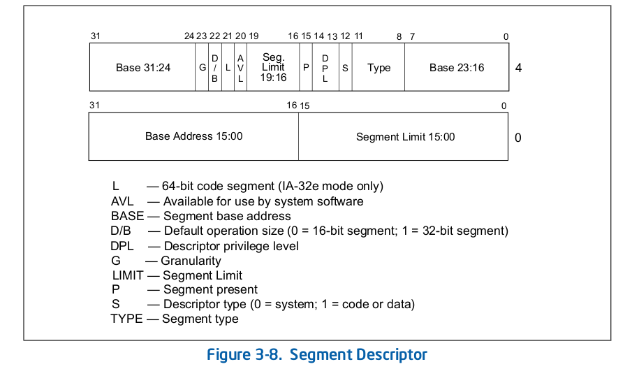

# Example: Segmentation

This example models an x86 segment descriptor, an in-memory data structure.

## Description

The following figure depicts the segment descriptor from the Intel 64 and IA-32 Architectures Software Developer’s Manual.



**Segment Limit**
Is a 20-bit value, concatenation of the two fields in the descriptor.
  - If `G == 0` then size is incremented in one byte granularity (1--1MByte)
  - If `G == 1` then size is incremented in 4k granularity (4k--4GBytes)

**Base Address**
Is a 32-bit value, concatenated of the two fields in the descriptor.
Alignment is ideally on a 16-byte boundary.

**DPL** Privilege Levels, value of 0-3.

**Type** If `S == 1` then bit 11 defines whether its
 - data (`0`), writable (bit 9 == 1), or read-only (bit 9 == 0)
 - code (`1`), readable (bit 9 == 1), or execute-only (bit 9 == 0)
Bit 8 indicates the accessed flag.

If `S == 0` this is a system-segment and gate-descriptor. Let's ignore that for now.


**S** Flag indicating whether this is a system segment (`S == 0`) or code/data (`S == 1`).

**P** Indicates whether the segment is present or not. If `P == 0` translation results in exception.

**D/B** Should always be set to `1` for 32-bit code.


## Unit Specification

```vrs, editable
unit X86SegmentDescriptor(..) {
    ..
}
```

## Generated Code

**Rust Code**
```rust
// nothing here yet
```

**C Code**
```c
// nothing here yet
```