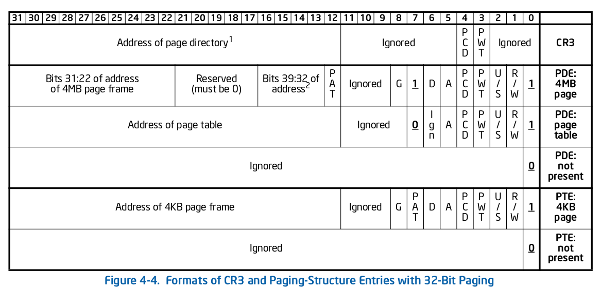

# Example: x86 Page Table (32-bits)

This example models an x86 page table, an in-memory data structure.

## Description

The following figure depicts the page table format from the Intel 64 and IA-32 Architectures Software Developer’s Manual.



### CR3

| Bit Positions | Contents                          |
|---------------|-----------------------------------|
| 3 (PWT)       | Set write-through                 |
| 4 (PCD)       | Set cache disabled                |
| 31:12 (Addr)  | Address of page directory         |

### Page Directory (Normal)

| Bit Positions | Contents                          |
|---------------|-----------------------------------|
| 0 (P)         | Present; must be 1 to map.        |
| 1 (R/W)       | If `1` writable                   |
| 2 (U/S)       | If `1` user mode access allowed   |
| 3 (PWT)       | Set write-through                 |
| 4 (PCD)       | Set cache disabled                |
| 5 (A)         | Access flag                       |
| 7 (PS)        | Page select. Must be 0            |
| 31:12 (Addr)  | Address of page table             |

### Page Directory (Super Page Mapping)

| Bit Positions | Contents                          |
|---------------|-----------------------------------|
| 0 (P)         | Present; must be 1 to map.        |
| 1 (R/W)       | If `1` writable                   |
| 2 (U/S)       | If `1` user mode access allowed   |
| 3 (PWT)       | Set write-through                 |
| 4 (PCD)       | Set cache disabled                |
| 5 (A)         | Access flag                       |
| 6 (D)         | Dirty flag                        |
| 7 (PS)        | Page select. Must be 1            |
| 31:22 (Addr)  | Address of frame                  |

### Page Table

The page table maps an aligned 4k page in memory.

| Bit Positions | Contents                          |
|---------------|-----------------------------------|
| 0 (P)         | Present; must be 1 to map.        |
| 1 (R/W)       | If `1` writable                   |
| 2 (U/S)       | If `1` user mode access allowed   |
| 3 (PWT)       | Set write-through                 |
| 4 (PCD)       | Set cache disabled                |
| 5 (A)         | Access flag                       |
| 6 (D)         | Dirty flag                        |
| 31:12 (Addr)  | Address of frame                  |

## Unit Specification (Page Table)

Editable field to fill in the spec. **Does not save**

```vrs, editable
unit X86PageTable(..) {
    ..
}
```
